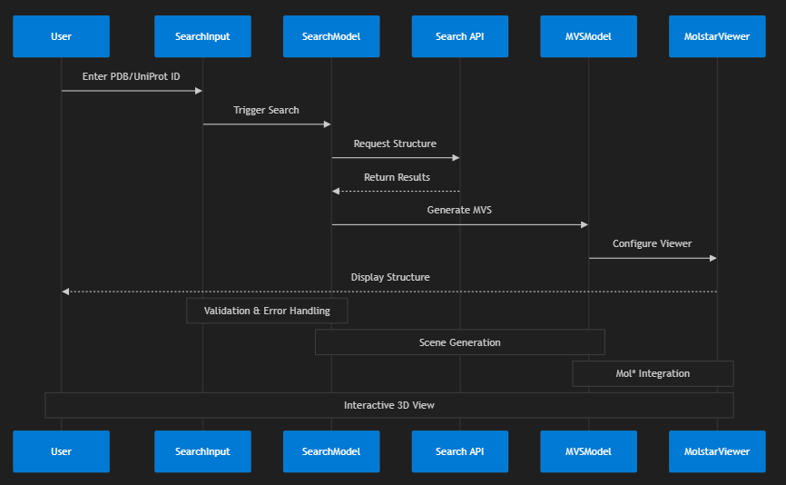

# Application Architecture

## Overview

This application is a React-based demonstration of programmatic MolViewSpec (MVS) creation and molecular visualization using Mol*. The architecture follows a feature-based structure with reactive state management using RxJS.

## Directory Structure

```
src/
├── features/           # Feature-based modules
│   ├── mapping/       # Structure mapping functionality
│   ├── metadata/      # Metadata handling and display
│   ├── mvs/          # MolViewSpec generation and management
│   └── search/       # Search functionality
├── lib/               # Core utilities and shared functionality
└── styles/            # Global styles
```

## Key Features

### 1. MVS (MolViewSpec) Management
- Located in `src/features/mvs/`
- Handles creation and manipulation of MolViewSpec files
- Core Components:
  - `MVSWrapper`: High-level container managing MVS state
  - `MolstarContainer`: Integration with Mol* viewer
  - `MolstarViewer`: Pure presentation component for 3D visualization

### 2. Search Feature
- Located in `src/features/search/`
- Manages structure search functionality
- Uses reactive state management for search results
- Components:
  - `SearchContainer`: Main search orchestration
  - `SearchInput`: User input handling
  - `SearchResults`: Results display

### 3. Metadata Management
- Located in `src/features/metadata/`
- Handles structure metadata and descriptions
- Provides reactive metadata updates

## Mol* Integration Details

### 1. Plugin Initialization
```typescript
// Creating a Mol* viewer instance with custom configuration
function createViewer() {
    const spec = DefaultPluginUISpec();
    const plugin = new PluginUIContext({
        ...spec,
        layout: {
            initial: {
                isExpanded: false,
                showControls: false,
            },
        },
        behaviors: [...spec.behaviors, PluginSpec.Behavior(MolViewSpec)],
        config: [
            [PluginConfig.Viewport.ShowAnimation, false],
            [PluginConfig.Viewport.ShowSelectionMode, false],
            [PluginConfig.Viewport.ShowExpand, false],
            [PluginConfig.Viewport.ShowControls, false],
        ],
    });
    return plugin;
}
```

### 2. MVS Generation
```typescript
// Creating a MolViewSpec snapshot from scene data
async function getMVSSnapshot(story: Story, scene: SceneData): Promise<Snapshot> {
    // Create a state provider function from scene JavaScript
    const stateProvider = createStateProvider(`
        async function _run_builder() {
            ${story.javascript}\n\n${scene.javascript}
        }
        return _run_builder();
    `);
    
    // Build the MVS snapshot
    const builder = MVSData.createBuilder();
    await stateProvider(builder);
    
    return builder.getSnapshot({
        key: scene.key,
        title: scene.header,
        description: scene.description,
        linger_duration_ms: scene.linger_duration_ms || 5000,
        transition_duration_ms: scene.transition_duration_ms || 500,
    });
}
```

### 3. Loading Structures
```typescript
// Loading a molecular story into the viewer
async function loadStory(story: Story) {
    // Generate snapshots for each scene
    const snapshots: Snapshot[] = [];
    for (const scene of story.scenes) {
        const snapshot = await getMVSSnapshot(story, scene);
        snapshots.push(snapshot);
    }

    // Create MVS data structure
    const mvsData: MVSData = {
        kind: 'multiple',
        metadata: {
            title: story.metadata.title,
            timestamp: new Date().toISOString(),
            version: MVSData.SupportedVersion,
        },
        snapshots,
    };

    // Load data into Mol* viewer
    await loadMVSData(plugin, mvsData, 'mvsj');
}
```

### 4. State Management
```typescript
// Managing viewer state and scene transitions
function useMolstarState(plugin: PluginUIContext, story: Story, model: MVSModel) {
    // Listen for snapshot changes
    useEffect(() => {
        const subscription = plugin.managers.snapshot.events.changed
            .pipe(
                debounceTime(100),
                filter(() => !!plugin.managers.snapshot.current)
            )
            .subscribe(() => {
                const current = plugin.managers.snapshot.current;
                if (current?.key) {
                    model.setCurrentSceneKey(current.key);
                }
            });

        return () => subscription.unsubscribe();
    }, [plugin, story, model]);

    // Handle scene transitions
    useEffect(() => {
        const subscription = model.selectors.story.currentScene()
            .pipe(filter((key): key is string => key !== null))
            .subscribe(async (sceneKey: string) => {
                const entry = plugin.managers.snapshot.state.entries
                    .find(e => e.key === sceneKey);
                
                if (entry) {
                    await PluginCommands.State.Snapshots.Apply(plugin, { 
                        id: entry.snapshot.id 
                    });
                }
            });

        return () => subscription.unsubscribe();
    }, [plugin, model]);
}
```

### 5. Data Flow Example
When loading a molecular structure:
1. User initiates search or selects structure
2. Application generates MVS data:
   ```typescript
   const mvsData = {
       kind: 'multiple',
       metadata: {
           title: "Structure Visualization",
           version: "1.0"
       },
       snapshots: [{
           key: "scene1",
           title: "Initial View",
           description: "Full structure view",
           // State tree defining the visualization
           state: {/* Mol* state tree */}
       }]
   };
   ```
3. MVS data is loaded into Mol*:
   ```typescript
   await loadMVSData(plugin, mvsData, 'mvsj');
   ```
4. Viewer updates and renders structure

## State Management

The application uses a reactive state management pattern based on RxJS:

1. **Reactive Models**
   - Located in `src/lib/reactive-model.ts`
   - Provides observable state management
   - Used by feature-specific models (e.g., `SearchModel`, `MVSModel`)

2. **Custom Hooks**
   - `useReactiveModel`: Connects reactive models to React components
   - `useObservable`: General-purpose RxJS integration

## Data Flow



1. User initiates search via `SearchInput`
2. `SearchModel` processes query and updates state
3. Results trigger MVS generation in `MVSModel`
4. `MolstarViewer` renders the molecular visualization
5. `MetadataModel` provides supplementary information

## Integration Points

### 1. Mol* Integration
- `MVSWrapper` serves as the primary integration point
- Handles:
  - MVS file generation
  - Viewer configuration
  - Structure loading
  - View state management

### 2. Search Integration
- `SearchContainer` orchestrates search functionality
- Connects to:
  - External structure databases
  - Local structure cache
  - Results processing

## State Management Details

### Observable Pattern
```typescript
// Example of reactive model usage
class SearchModel extends ReactiveModel {
  private searchState = new BehaviorSubject<SearchState>({...});
  
  // Observable state access
  get state$() { return this.searchState.asObservable(); }
  
  // State updates
  updateSearch(query: string) {
    this.searchState.next({...});
  }
}
```

### Component Integration
```typescript
// Example of component integration
function SearchComponent() {
  const searchModel = useReactiveModel(SearchModel);
  const state = useObservable(searchModel.state$);
  
  // Component logic using reactive state
}
```

## Testing Strategy

1. **Unit Tests**
   - Component tests using React Testing Library
   - Model tests for business logic
   - Utility function tests

2. **Integration Tests**
   - Feature-level integration testing
   - Mol* integration verification
   - Search flow validation

## Performance Considerations

1. **Reactive Updates**
   - State updates are granular and efficient
   - Components re-render only when necessary
   - RxJS operators optimize data flow

2. **Visualization Performance**
   - Mol* viewer initialization is optimized
   - Structure loading is handled asynchronously
   - View state updates are batched when possible

## Extension Points

The architecture supports extension through:

1. **New Features**
   - Add new directories under `features/`
   - Implement feature-specific models
   - Create necessary UI components

2. **Custom Visualizations**
   - Extend `MVSModel` for new visualization types
   - Add custom scene generators
   - Implement specialized viewers

3. **Additional Data Sources**
   - Extend search functionality
   - Add new metadata providers
   - Implement custom data transformations 